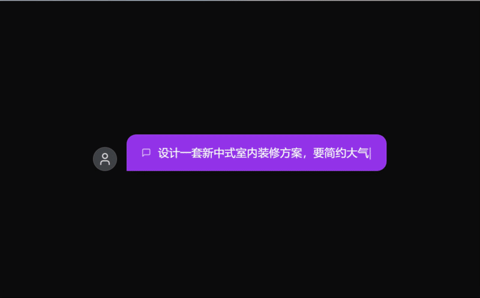
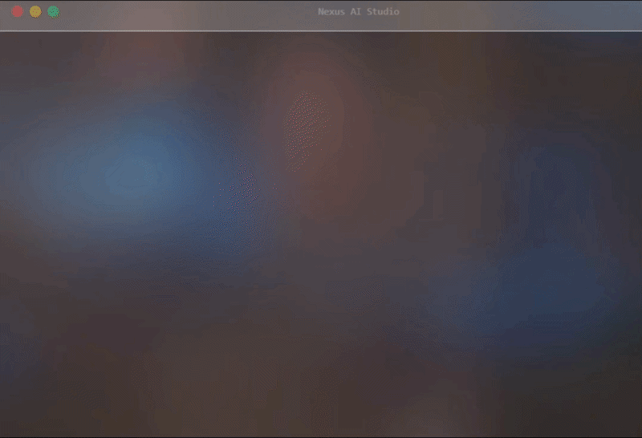

<p align="center">
  
</p>

<h1 align="center">CanvasAnvil</h1>

<p align="center">
  <a href="README.md">English</a> |
  <a href="README.zh-CN.md">简体中文</a> |
  <a href="README.zh-TW.md">繁體中文</a> |
  <a href="README.ja-JP.md">日本語</a> |
  <a href="README.ko-KR.md">한국어</a> |
  <a href="README.fr-FR.md">Français</a>
</p>

CanvasAnvil is a multi-canvas AI creation platform that turns a single requirement into deliverables you can iterate on.

## Canvas Previews

<div align="left">
  <div style="width: 680px;">
    <h3 align="center">Flow Canvas</h3>
    
  </div>
</div>

<div align="left">
  <div style="width: 680px;">
    <h3 align="center">CAD Canvas</h3>
    
  </div>
</div>

<div align="left">
  <div style="width: 680px;">
    <h3 align="center">PPT Canvas</h3>
    
  </div>
</div>

## Video Tutorials

- [Watch on Bilibili](https://www.bilibili.com/video/BV1jzZ3BBEHc?vd_source=b6b031f92061ae667eba1185f4782a1c)
- [Watch on YouTube](https://youtu.be/n3Otj--aLRo)
- [Watch on Douyin](https://v.douyin.com/JwlwhmE6R40/)

## Try CanvasAnvil

- [Open CanvasAnvil](https://canvasanvil.codingfgd.asia)
- Note: The current server configuration is modest, so the service may occasionally feel slow or laggy. Thanks for your understanding.

## Capability Overview (User View)

- `Flow`: flowchart generation and partial edits (draw.io XML)
- `CAD`: interior design planning, analysis boards, 2D floor plans, render tasks, and BOM
- `PPT`: presentation draft generation and iterative editing

## Typical Workflow

1. Enter your requirement
2. Generate/iterate on design plan
3. Generate analysis boards and confirm strategy
4. Generate and edit 2D floor plan
5. Export outputs (diagrams / lists / slides)

## Quick Start

1. Install dependencies
```bash
npm install
```
2. Start development
```bash
npm run dev
```
Default URL: `http://localhost:5173`

3. Type check
```bash
npm run check
```
4. Production build
```bash
npm run build
```

## Origins and Integrations

- Flow canvas: integrated and enhanced from [next-ai-draw-io](https://github.com/DayuanJiang/next-ai-draw-io)
- PPT canvas: integrated and enhanced from [banana-slides](https://github.com/Anionex/banana-slides.git)
- CAD canvas: implemented in-house (architecture, agent workflow, 2D SVG editing pipeline, BOM/render pipeline)

Key improvements:

- Unified UX across canvases (chat, code blocks, one-click apply to canvas)
- More stable agent routing and retry mechanisms
- CAD-specific capabilities (patch / replace / BOM / 7-slot render workflow)
- Cross-canvas state/version/export pipelines

## Core Capabilities (Developer View)

- Flow: chat-driven flowchart generation, patch/replace, one-click apply, snapshot restore
- CAD: `cad_plan` output, parallel analysis-board generation, 2D SVG partial updates with analysis-image references, concurrent render jobs, BOM export
- PPT: structured content generation, page-level incremental edits, streaming iteration

## Tech Stack

- Frontend: React 18 + TypeScript + Vite
- UI: Tailwind CSS + Radix UI + Lucide
- Diagram engines: draw.io/diagrams.net for Flow, SVG-Edit for CAD
- Model integration: configurable multi-model access (chat / image)

## Useful Scripts

- `npm run dev`: start development server
- `npm start`: production start (static site + API)
- `npm run build`: production build
- `npm run check`: TypeScript check
- `npm run lint`: ESLint

## Project Structure (Key Paths)

```text
.
├─ agent/                      # Prompts and sub-agent specs for CAD/Flow/PPT
├─ public/                     # Static assets (including SVG-Edit)
├─ src/
│  └─ workspaces/
│     ├─ flow/                 # Flow canvas
│     ├─ cad/                  # CAD canvas (in-house core)
│     └─ ppt/                  # PPT canvas
├─ api/                        # API logic
└─ README.md
```

## Docs

- Deployment guide: [Open deployment guide](deploy/README.md)

## WeChat

我的微信二维码如下，欢迎联系我。

<p align="left">
  
</p>
