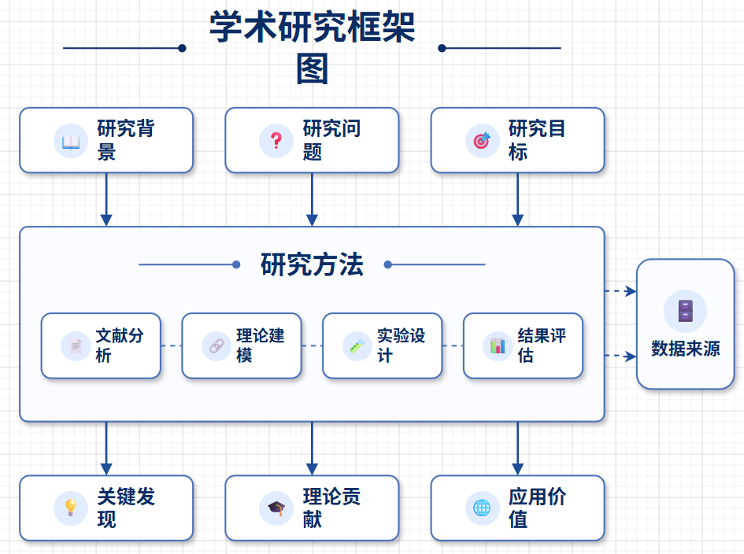
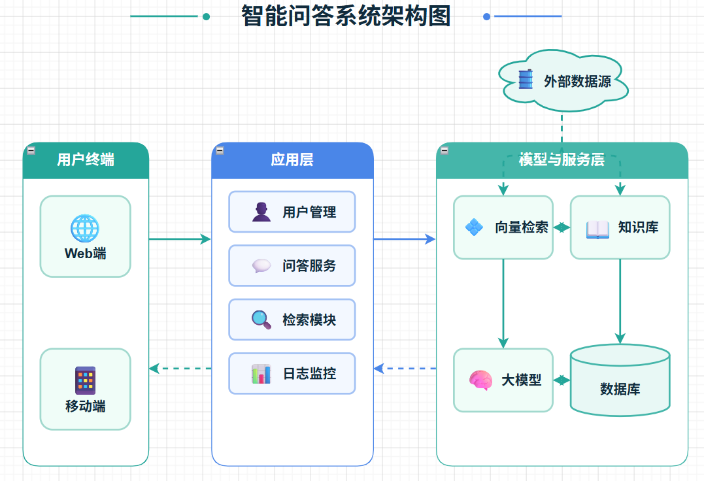
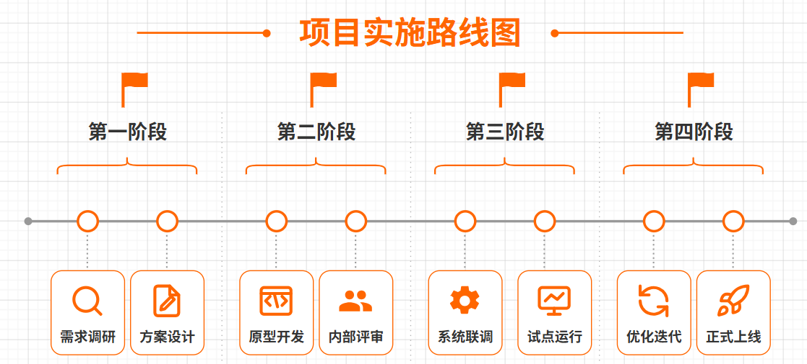
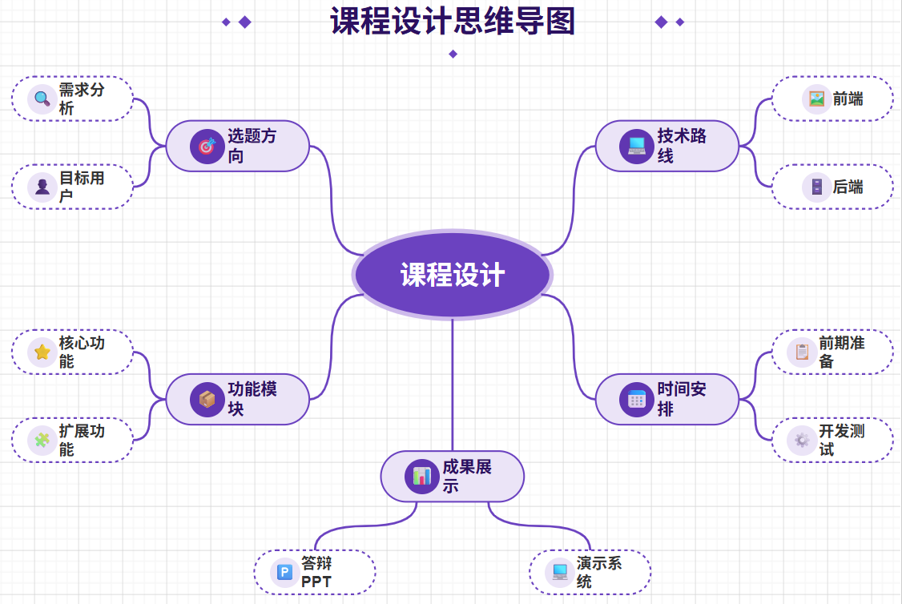

<p align="center">
  
</p>

<h1 align="center">CanvasAnvil</h1>

<p align="center">
  <strong>面向流程绘制、室内设计、PPT、海报、信息图与产品介绍的多画布 AI 创作平台。</strong>
</p>

<p align="center">
  <a href="README.md">English</a> |
  <a href="README.zh-CN.md">简体中文</a>
</p>

<p align="center">
  
  
  
  
</p>

> CanvasAnvil 将流程图、室内设计工作流、PPT 制作、海报、信息图和产品介绍整合到一个统一工作区中。

## 版本发布

当前版本：`v2.0.0`

- `v2.0.0`：新增海报、信息图、产品介绍 3 个画布，新增本地 workflow skills，内嵌可编辑 PPT 编辑器，并扩展了更多模型与供应商适配
- `v1.0.2`：PPT 切换为图片优先工作流，并将 OCR/文字回填延后到可编辑 PPT 导出阶段
- `v1.0.1`：提升 PPT 与 CAD 资源持久化稳定性

## v2.0.0 更新内容

- 新增 `海报`、`信息图`、`产品介绍` 3 个画布
- 在 PPT 工作区内直接嵌入 `pptist-lab`，支持可编辑 PPT 继续加工
- 可编辑 PPT 导出流程调整为 `文本框校对 -> 提取文本 -> 开始编辑`
- PPT 校对阶段同时保留原始幻灯片版本与 `无字底图` 版本
- 提取后的文本会尽量保留字号、颜色、字重、字距、对齐和行高并带入嵌入式编辑器
- 扩展了更多 AI 模型与供应商适配，支持更灵活的模型配置
- 新增 `Flow`、`CAD`、`PPT`、`Poster`、`Infographic`、`Product` 的本地 workflow skills
- 新增脚本化 skill 工作流，覆盖图表导出、CAD 打包、PPT 模板/整套页面生成、图片生成、PDF 导出和图片版 PPT 导出
- 统一通过 `config/image-provider.json` 配置 skill 的生图模型
- CAD skill 的 BOM 输出改为 `cad_bom.csv`
- Flow skill 默认打包时不再生成独立 HTML 预览文件

## 示例资源目录

每个画布都有独立的示例资源目录，统一放在 `public/examples/` 下。

| 画布 | 示例目录 | 建议命名 |
| --- | --- | --- |
| `Flow` | `public/examples/flow/` | `01.png`、`02.png`、`03.png`、`04.png` |
| `CAD` | `public/examples/cad/` | `01.png` 到 `09.png` |
| `PPT` | `public/examples/ppt/` | `01.png` 到 `09.png` |
| `Poster` | `public/examples/poster/` | `01.png` 到 `04.png` |
| `Infographic` | `public/examples/infographic/` | `01.png` 到 `04.png` |
| `Product` | `public/examples/product/` | `01.png` 到 `04.png` |

示例图片应尽量保持轻量、适合网页展示。README 中的成品实例表格会从这些路径读取图片。

## 画布概览

| 画布 | 核心能力 | 常见输出 |
| --- | --- | --- |
| `Flow` | 结构化图表生成与局部编辑 | 流程图、架构图、逻辑图 |
| `CAD` | 室内设计流程规划与空间分析 | 分析板、2D 平面图、渲染任务、BOM |
| `PPT` | 结构化演示文稿生成与可编辑导出 | 演示文稿、汇报 deck、视觉化幻灯片 |
| `Poster` | 单页视觉编排 | 海报、主视觉、活动物料 |
| `Infographic` | 结构化信息可视化表达 | 信息图、讲解图、数据总结 |
| `Product` | 产品介绍与卖点叙事 | 产品页、卖点页、发布物料 |

## 流程绘制画布

将结构化提示快速转成清晰图表，并在同一画布中持续迭代布局、节点关系与说明文案。

### 成品实例

<table>
  <tr>
    <td width="50%" align="center"><br/>系统架构图</td>
    <td width="50%" align="center"><br/>业务流程图</td>
  </tr>
  <tr>
    <td width="50%" align="center"><br/>数据管线图</td>
    <td width="50%" align="center"><br/>逻辑映射图</td>
  </tr>
</table>

## 室内设计画布

打通规划板、2D 布局、材质方案、渲染编排和 BOM 输出来完成完整的室内设计工作流。

### 成品实例

<table>
  <tr>
    <td width="33.33%" align="center"><br/>规划板</td>
    <td width="33.33%" align="center"><br/>2D 平面布局</td>
    <td width="33.33%" align="center"><br/>客厅概念方案</td>
  </tr>
  <tr>
    <td width="33.33%" align="center"><br/>材质板</td>
    <td width="33.33%" align="center"><br/>灯光策略</td>
    <td width="33.33%" align="center"><br/>渲染任务</td>
  </tr>
  <tr>
    <td width="33.33%" align="center"><br/>功能分区</td>
    <td width="33.33%" align="center"><br/>BOM 汇总页</td>
    <td width="33.33%" align="center"><br/>最终展示板</td>
  </tr>
</table>

## PPT 演示画布

支持结构化生成演示文稿、图片优先迭代、文本框校对，并在嵌入式 PPT 编辑器中继续编辑。

### 成品实例

<table>
  <tr>
    <td width="33.33%" align="center"><br/>封面页</td>
    <td width="33.33%" align="center"><br/>目录页</td>
    <td width="33.33%" align="center"><br/>商业汇报页</td>
  </tr>
  <tr>
    <td width="33.33%" align="center"><br/>数据讲述页</td>
    <td width="33.33%" align="center"><br/>教学演示页</td>
    <td width="33.33%" align="center"><br/>科技风方案页</td>
  </tr>
  <tr>
    <td width="33.33%" align="center"><br/>产品介绍页</td>
    <td width="33.33%" align="center"><br/>信息图演示页</td>
    <td width="33.33%" align="center"><br/>可编辑导出结果</td>
  </tr>
</table>

## 海报画布

适合快速完成单页视觉编排，支持更强的版式控制、字体层次与海报型构图表达。

### 成品实例

<table>
  <tr>
    <td width="50%" align="center"><br/>品牌活动海报</td>
    <td width="50%" align="center"><br/>展会海报</td>
  </tr>
  <tr>
    <td width="50%" align="center"><br/>主视觉海报</td>
    <td width="50%" align="center"><br/>新品发布海报</td>
  </tr>
</table>

## 信息图画布

将信息密度较高的内容整理成清晰的视觉叙事，兼顾可读性与展示效果。

### 成品实例

<table>
  <tr>
    <td width="50%" align="center"><br/>数据总结图</td>
    <td width="50%" align="center"><br/>流程讲解图</td>
  </tr>
  <tr>
    <td width="50%" align="center"><br/>对比分析图</td>
    <td width="50%" align="center"><br/>时间线布局</td>
  </tr>
</table>

## 产品介绍画布

围绕产品卖点、规格和主视觉组织信息，适合输出产品介绍、上线页与营销讲述内容。

### 成品实例

<table>
  <tr>
    <td width="50%" align="center"><br/>产品首页</td>
    <td width="50%" align="center"><br/>功能对比页</td>
  </tr>
  <tr>
    <td width="50%" align="center"><br/>规格页</td>
    <td width="50%" align="center"><br/>发布叙事页</td>
  </tr>
</table>

## 快速开始

1. 安装依赖

```bash
npm install
```

2. 启动本地开发

可编辑 PPT 场景下需要同时启动两个服务：

- 主应用运行在 `5173`
- `pptist-lab` 运行在 `5174`

```bash
npm run dev

cd pptist-lab
npm install
npm run dev -- --host 127.0.0.1 --port 5174
```

默认访问地址：

- 主应用：`http://127.0.0.1:5173`
- PPT 编辑器服务：`http://127.0.0.1:5174`

3. 运行类型检查

```bash
npm run check
```

4. 构建生产版本

```bash
npm run build
```

## 常用脚本

- `npm run dev`：启动主应用 Vite 开发服务
- `npm run dev:full`：同时启动 Web 与 API 开发服务
- `npm run dev:web`：仅启动前端开发服务
- `npm run dev:api`：仅启动 API 开发服务
- `cd pptist-lab && npm run dev -- --host 127.0.0.1 --port 5174`：启动嵌入式 PPT 编辑器服务
- `npm run check`：执行 TypeScript 检查
- `npm run lint`：执行 ESLint
- `npm run build`：构建生产版本
- `npm run preview`：预览构建产物
- `npm start`：启动 API 服务

## 开发说明

- AI 配置读取本地应用设置，可切换到自定义供应商
- PPT 本地开发依赖 `/api/ppt-ai` 代理路由
- 修改 `vite.config.ts` 中的本地 API 路由后，需要重启开发服务

## 文档

- 部署说明：[deploy/README.md](deploy/README.md)

## 许可证

CanvasAnvil 采用 GNU Affero General Public License v3.0（AGPL-3.0）协议发布。
完整协议内容请查看 [LICENSE](LICENSE)。

## 联系方式

- `3524962421@qq.com`
