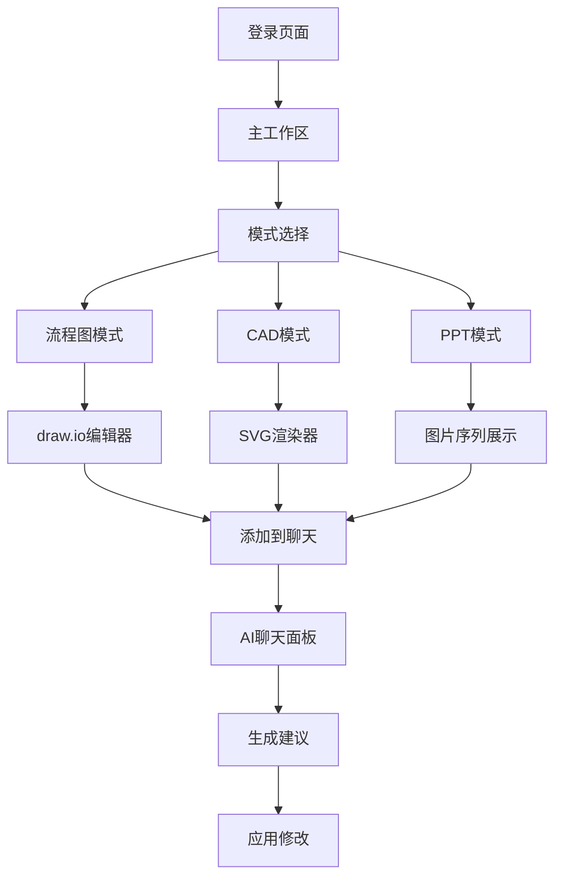

## 1. 产品概述

统一AI工作空间是一个集成多种工作模式的协作平台，通过分屏布局将工作区与AI聊天面板结合，为用户提供流程图设计、CAD绘图和PPT制作的无缝体验。

该产品主要解决设计师、工程师和项目管理者在多工具间切换的效率问题，通过AI驱动的聊天界面统一控制各种工作模式，提升工作流程的连贯性和智能化水平。

## 2. 核心功能

### 2.1 用户角色

| 角色 | 注册方式 | 核心权限 |
|------|----------|----------|
| 普通用户 | 邮箱注册 | 使用基础工作模式，保存项目 |
| 高级用户 | 邀请码升级 | 导出高级格式，团队协作，AI增强功能 |

### 2.2 功能模块

统一AI工作空间包含以下核心页面：

1. **主工作区**：分屏布局，左侧工作区域，右侧聊天面板
2. **模式切换栏**：流程图模式、CAD模式、PPT模式的快速切换
3. **项目管理**：项目列表、新建、保存、导出功能

### 2.3 页面详情

| 页面名称 | 模块名称 | 功能描述 |
|----------|----------|----------|
| 主工作区 | 分屏布局 | 实现可调整大小的左右分屏，左侧占60%显示工作区，右侧40%显示聊天面板 |
| 主工作区 | 模式切换 | 提供三种工作模式的图标切换按钮，支持快捷键切换 |
| 流程图模式 | draw.io集成 | 嵌入draw.io编辑器，支持节点选择和边选择，点击"添加到聊天"发送XML片段 |
| CAD模式 | SVG渲染器 | 加载和显示2D CAD文件（SVG格式），支持元素点击选择，发送Python/CAD代码片段 |
| PPT模式 | 图片序列 | 按顺序显示多张图片，支持前后翻页，缩略图预览 |
| 聊天面板 | 消息列表 | 显示用户与AI的对话历史，支持消息时间戳和发送者标识 |
| 聊天面板 | 输入框 | 支持多行文本输入，发送按钮，清空聊天记录功能 |
| 项目管理 | 文件操作 | 新建项目、打开项目、保存项目、导出为不同格式 |

## 3. 核心流程

用户进入主工作区后，可以通过顶部工具栏选择工作模式：

**流程图模式流程**：
1. 用户选择流程图模式，加载draw.io编辑器
2. 在左侧绘制流程图，选择节点或连接线
3. 点击"添加到聊天"按钮，将选中元素的XML数据发送到右侧聊天面板
4. 在聊天面板中与AI对话，AI根据流程图内容提供建议

**CAD模式流程**：
1. 用户切换到CAD模式，加载SVG文件
2. 点击CAD图形中的元素进行选择
3. 点击"添加到聊天"，发送对应的Python/CAD代码片段
4. AI分析代码并提供修改建议或生成相关代码

**PPT模式流程**：
1. 用户进入PPT模式，上传或选择图片序列
2. 使用导航控件浏览不同页面
3. 在聊天面板中描述需求，AI协助生成新的幻灯片内容

## 4. 用户界面设计

### 4.1 设计风格

- **主色调**：深蓝色（#1e40af）作为主色，浅灰色（#f3f4f6）作为背景
- **按钮样式**：圆角矩形，悬停效果，主要操作为实心按钮，次要操作为边框按钮
- **字体**：Inter字体族，标题18px，正文14px，小字12px
- **布局风格**：卡片式布局，阴影效果，适当的间距和留白
- **图标风格**：使用Lucide图标库，线条简洁，统一大小20x20px

### 4.2 页面设计概述

| 页面名称 | 模块名称 | UI元素 |
|----------|----------|----------|
| 主工作区 | 分屏布局 | 使用React Resizable Panels，支持拖拽调整比例，最小宽度限制 |
| 主工作区 | 顶部工具栏 | 固定在顶部，包含模式切换按钮组，项目操作按钮，用户信息 |
| 流程图模式 | 编辑器容器 | iframe嵌入draw.io，边框阴影，加载状态指示器 |
| CAD模式 | SVG容器 | 自适应大小，支持缩放和平移，选中元素高亮显示 |
| PPT模式 | 图片容器 | 居中显示，支持键盘左右箭头导航，底部缩略图条 |
| 聊天面板 | 消息气泡 | 用户消息右对齐蓝色背景，AI消息左对齐白色背景 |
| 聊天面板 | 输入区域 | 底部固定，包含文本框和发送按钮，支持Enter快捷键 |

### 4.3 响应式设计

采用桌面优先设计策略：
- 最小支持宽度：1280px
- 工作区与聊天面板比例可在40:60到80:20之间调整
- 移动端采用堆叠布局，工作区在上，聊天面板在下
- 触摸优化：增大点击区域，支持手势缩放

### 4.4 交互细节

- 模式切换使用平滑过渡动画，时长300ms
- 添加到聊天按钮在选中元素后显示，带有脉冲动画提示
- 聊天消息发送后显示打字指示器，模拟AI思考过程
- 所有操作提供视觉反馈，成功/失败状态用颜色和图标区分