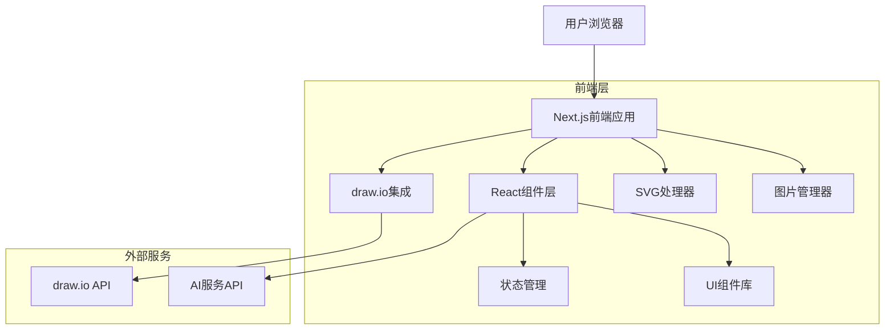

## 1. 架构设计



## 2. 技术描述

- **前端框架**: Next.js@14 + React@18 + TypeScript@5
- **UI组件库**: shadcn/ui + Radix UI + Tailwind CSS@3
- **图标库**: Lucide React
- **布局管理**: React Resizable Panels
- **状态管理**: Zustand
- **构建工具**: Next.js内置构建系统
- **包管理**: pnpm

### 核心依赖
```json
{
  "dependencies": {
    "next": "^14.0.0",
    "react": "^18.2.0",
    "react-dom": "^18.2.0",
    "@radix-ui/react-": "^latest",
    "lucide-react": "^latest",
    "react-resizable-panels": "^latest",
    "zustand": "^latest",
    "clsx": "^latest",
    "tailwind-merge": "^latest"
  },
  "devDependencies": {
    "typescript": "^5.0.0",
    "@types/react": "^18.2.0",
    "@types/react-dom": "^18.2.0",
    "tailwindcss": "^3.3.0",
    "autoprefixer": "^latest",
    "postcss": "^latest"
  }
}
```

## 3. 路由定义

| 路由 | 用途 |
|------|------|
| `/` | 主页，重定向到工作区 |
| `/workspace` | 主工作区，包含分屏布局和模式切换 |
| `/workspace/flowchart` | 流程图模式，集成draw.io编辑器 |
| `/workspace/cad` | CAD模式，SVG渲染和交互 |
| `/workspace/ppt` | PPT模式，图片序列展示 |
| `/api/chat` | 聊天API，处理AI对话请求 |
| `/api/project/save` | 项目保存API |
| `/api/project/load` | 项目加载API |
| `/api/project/export` | 项目导出API |

## 4. 核心组件架构

### 4.1 主布局组件
```typescript
interface MainLayoutProps {
  children: React.ReactNode;
  defaultLayout?: number[];
  defaultCollapsed?: boolean;
}

interface PanelLayout {
  leftPanel: number;  // 百分比 40-80%
  rightPanel: number; // 百分比 20-60%
}
```

### 4.2 工作模式状态管理
```typescript
interface WorkspaceState {
  currentMode: 'flowchart' | 'cad' | 'ppt';
  isLoading: boolean;
  selectedElements: SelectedElement[];
  chatHistory: ChatMessage[];
}

interface SelectedElement {
  id: string;
  type: 'node' | 'edge' | 'cad-element' | 'slide';
  data: any;  // XML, Python代码, 图片数据等
  timestamp: number;
}

interface ChatMessage {
  id: string;
  role: 'user' | 'assistant';
  content: string;
  timestamp: number;
  mode?: string;  // 关联的工作模式
}
```

### 4.3 draw.io集成接口
```typescript
interface DrawIOIntegration {
  embedUrl: string;
  onElementSelect: (element: DrawElement) => void;
  getSelectedXML: () => string;
  addToChat: (xmlData: string) => void;
}

interface DrawElement {
  id: string;
  type: 'node' | 'edge';
  label: string;
  xmlData: string;
  bounds: DOMRect;
}
```

### 4.4 CAD模式接口
```typescript
interface CADViewerProps {
  svgContent: string;
  onElementClick: (element: CADElement) => void;
  zoomLevel: number;
  panOffset: { x: number; y: number };
}

interface CADElement {
  id: string;
  type: string;  // 'line' | 'circle' | 'rectangle' | 'path'
  properties: Record<string, any>;
  pythonCode?: string;
  cadCode?: string;
}
```

### 4.5 PPT模式接口
```typescript
interface PPTViewerProps {
  slides: Slide[];
  currentSlide: number;
  onSlideChange: (index: number) => void;
  showThumbnails: boolean;
}

interface Slide {
  id: string;
  imageUrl: string;
  title?: string;
  notes?: string;
  order: number;
}
```

## 5. 状态管理设计

```typescript
// Zustand store结构
interface AppStore {
  // UI状态
  sidebarCollapsed: boolean;
  panelLayout: PanelLayout;
  theme: 'light' | 'dark';
  
  // 工作区状态
  workspace: WorkspaceState;
  
  // 项目状态
  currentProject: Project | null;
  unsavedChanges: boolean;
  
  // 方法
  setPanelLayout: (layout: PanelLayout) => void;
  switchMode: (mode: WorkspaceMode) => void;
  addToChat: (element: SelectedElement) => void;
  sendMessage: (message: string) => Promise<void>;
  saveProject: () => Promise<void>;
}

interface Project {
  id: string;
  name: string;
  mode: WorkspaceMode;
  data: any;  // 模式特定的数据
  createdAt: Date;
  updatedAt: Date;
}
```

## 6. 组件层次结构

```
src/
├── app/
│   ├── layout.tsx          # 根布局
│   ├── page.tsx            # 主页
│   └── workspace/
│       ├── page.tsx        # 工作区主页面
│       └── [mode]/
│           └── page.tsx    # 特定模式页面
├── components/
│   ├── workspace/
│   │   ├── MainLayout.tsx      # 主布局组件
│   │   ├── PanelLayout.tsx     # 分屏布局组件
│   │   ├── ModeSelector.tsx    # 模式选择器
│   │   ├── Toolbar.tsx         # 工具栏
│   │   └── StatusBar.tsx       # 状态栏
│   ├── flowchart/
│   │   ├── DrawIOViewer.tsx    # draw.io查看器
│   │   ├── ElementSelector.tsx # 元素选择器
│   │   └── XMLParser.ts        # XML解析工具
│   ├── cad/
│   │   ├── SVGViewer.tsx       # SVG查看器
│   │   ├── ElementHighlighter.tsx # 元素高亮
│   │   └── CodeGenerator.ts    # 代码生成器
│   ├── ppt/
│   │   ├── SlideViewer.tsx     # 幻灯片查看器
│   │   ├── ThumbnailBar.tsx    # 缩略图条
│   │   └── ImageUploader.tsx   # 图片上传器
│   └── chat/
│       ├── ChatPanel.tsx       # 聊天面板
│       ├── MessageList.tsx     # 消息列表
│       ├── MessageInput.tsx    # 消息输入
│       └── MessageBubble.tsx   # 消息气泡
├── lib/
│   ├── hooks/              # 自定义hooks
│   ├── utils/              # 工具函数
│   └── stores/             # 状态管理
└── types/                  # TypeScript类型定义
```

## 7. 性能优化策略

### 7.1 代码分割
- 按工作模式进行代码分割，减少初始加载时间
- 动态导入draw.io等大型依赖
- 使用Next.js的自动代码分割功能

### 7.2 缓存策略
- 使用React.memo优化组件重渲染
- 实现虚拟滚动处理大量聊天消息
- 缓存解析后的SVG和XML数据

### 7.3 加载优化
- 图片懒加载和预加载策略
- draw.io编辑器的异步加载
- 骨架屏提升感知性能

## 8. 错误处理

### 8.1 错误边界
```typescript
interface ErrorBoundaryState {
  hasError: boolean;
  error: Error | null;
  errorInfo: ErrorInfo | null;
}
```

### 8.2 错误类型
- 网络错误：API调用失败处理
- 解析错误：XML/SVG解析失败
- 集成错误：draw.io加载失败
- 用户操作错误：文件格式不支持

## 9. 安全性考虑

### 9.1 XSS防护
- 对用户输入进行转义
- SVG内容的安全检查
- iframe的沙箱属性配置

### 9.2 CSRF防护
- API请求使用CSRF token
- 文件上传的安全验证
- 跨域请求的正确配置

## 10. 开发环境配置

### 10.1 环境变量
```env
NEXT_PUBLIC_API_URL=http://localhost:3000/api
NEXT_PUBLIC_DRAWIO_URL=https://embed.diagrams.net
NEXT_PUBLIC_AI_SERVICE_URL=https://api.example.com
```

### 10.2 开发脚本
```json
{
  "scripts": {
    "dev": "next dev",
    "build": "next build",
    "start": "next start",
    "lint": "next lint",
    "type-check": "tsc --noEmit"
  }
}
```

### 10.3 构建配置
- Next.js配置文件优化
- Tailwind CSS配置
- TypeScript严格模式启用
- ESLint和Prettier代码规范